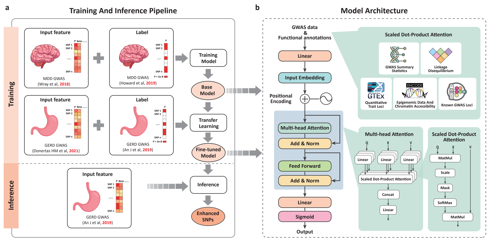

# InsightGWAS: MDD-GERD Transformer-Based Model for GWAS Analysis

## Overview

InsightGWAS is a Transformer-based deep learning framework designed to prioritize genetic variants associated with complex diseases using **genome-wide association studies (GWAS) summary statistics** and **multi-modal genomic annotations**. The repository provides MDD-GERD Transformer Model:

**MDD-GERD Transformer Model**: Pre-trained on Major Depressive Disorder (MDD) GWAS data and fine-tuned on Gastroesophageal Reflux Disease (GERD) data.

### Running the MDD-GERD Transformer Model Scripts
Execute the scripts in the following order:

1. **Train the initial model on MDD data**:
   ```bash
   python 1_train_model.py
   ```

2. **Perform transfer learning using GERD data**:
   ```bash
   python 2_transform_learning_model.py
   ```

3. **Run inference**:
   ```bash
   python 3_inference.py
   ```


After running the inference script, the results will be saved in a file named `Predicted_SNPs.txt`.

The models integrate **functional genomic data** (e.g., eQTL, sQTL, chromatin accessibility, and transcription factor binding sites) to enhance the detection of disease-associated genetic variants.

## Input Data
The input features for each SNP variant include **GWAS statistics** and **functional annotations**, structured as follows:

| Feature Category         | Description |
|--------------------------|-------------|
| **Genomic Position**     | `chr`, `bpos` (chromosome and base position) |
| **GWAS Summary Stats**   | `beta`, `se`, `p-value`, `sample size (N)` |
| **Regulatory Annotations** | `sQTL`, `eQTL`, `brain eQTL`, `all eQTL`, `mQTL` |
| **Chromatin Features**    | `OCRs (open chromatin regions)`, `encode`, `footprints` |
| **Transcription Factor Binding** | `tfbsConsSites`, `targetScanS.wgRna` |
| **Genomic Evolutionary Features** | `genomicSuperDups`, `CADD score`, `GWAVA score` |
| **LD-related metrics** | `ldscore`, `allele frequency (freq)` |
| **Previous GWAS Evidence** | `reported in previous GWAS` |

The dataset has been **randomly downsampled to 10%** of the full dataset to provide a lightweight example. **This subset does not reflect the actual model performance** but serves as a demonstration.

## Model Architecture

The Transformer model consists of:
- **Multi-Head Self-Attention**: Captures interactions between SNP features, allowing the model to learn complex regulatory effects.
- **Feed-Forward Neural Networks**: Introduces non-linearity to improve feature learning.
- **Positional Encoding**: Retains order information in feature representations.
- **Binary Classification Output**: Predicts whether an SNP is significantly associated with a disease (0/1 classification).

Each Transformer encoder consists of:
- **4 attention heads**
- **2 layers**
- **Hidden dimension of 64**
- **Fully connected output layer with sigmoid activation**

The model is trained using **binary cross-entropy loss (BCE Loss)** with the Adam optimizer.

## Data Preprocessing
The following preprocessing steps are applied to input data:
1. **Standardization**: GWAS summary statistics and functional annotation scores are standardized using `StandardScaler`.
2. **Train-Test Split**: Data is randomly split into **80% training and 20% validation**.
3. **Data Loading**: Tensor representations are created for efficient training using PyTorch's `DataLoader`.
4. **Class Balancing**: The dataset contains an imbalanced number of positive (disease-associated) and negative SNPs, so **weight adjustments** may be applied.

## Required Libraries
Ensure you have the following Python libraries installed:
- `torch`
- `pandas`
- `scikit-learn`
- `numpy`

## Example Data
The dataset used in these scripts is **randomly sampled (10%) from the full dataset** for demonstration purposes. **This is only an example and does not reflect the actual model performance.** The full dataset is not included due to privacy concerns.
